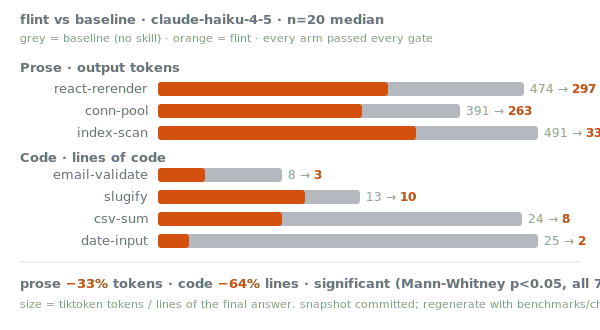
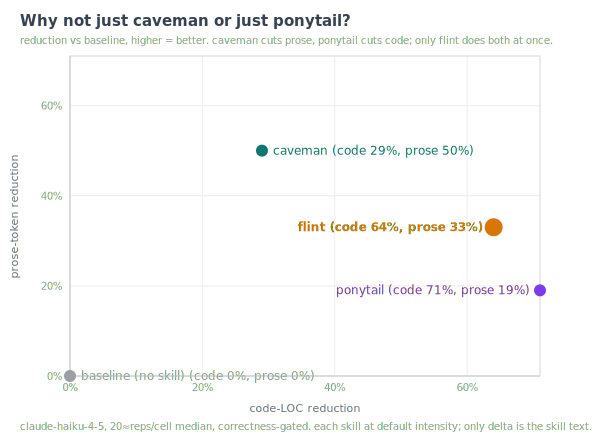
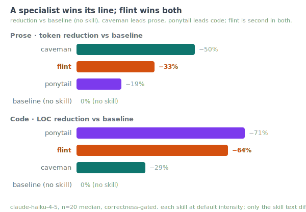
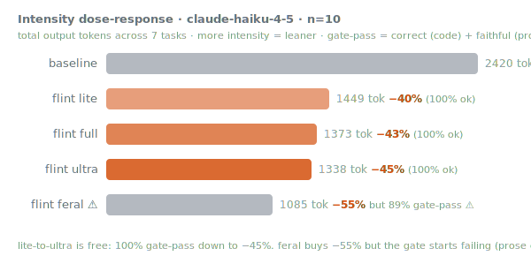

<p align="center">
  
</p>

<p align="center"><em>Less talk. Better code, with receipts.</em></p>

**One operating mode for a coding agent: say less, build less, claim less, build right.**

Coding agents default to four expensive habits: they write walls of prose, they over-build code
nobody asked for, they drift from sound engineering, and they report results before the results
are true. flint is a single skill that fixes all four with one reflex, **least necessary**:

- least words past the point you understood,
- least code past the point it works,
- least claim past the point it's proven.

It fuses four existing ideas into one cohesive mode so you don't have to juggle four skills:

| edge | from | what it does |
|------|------|--------------|
| **Talk lean** | [caveman](https://github.com/juliusbrussee/caveman) | Leaner output. Drops filler, keeps code/errors/commands verbatim. Cuts prose tokens ~50% on its own in the benchmark below. |
| **Build only what's needed** | [ponytail](https://github.com/DietrichGebert/ponytail) | A decision ladder runs *before* any code: YAGNI → stdlib → native → installed dep → one line → minimum. |
| **Build right** | [eng-audit](https://github.com/jah2488/eng-audit) | Nine engineering principles applied while building, plus a phase-boundary audit. |
| **Claim only what's proven** | [ultravalidate](https://github.com/jah2488/ultravalidate) | Refute-don't-confirm reflex before any result, number, or PR claim. |

> Other compression skills make the agent *talk* small. Other minimalist skills make it *write*
> small. flint also makes it **build to principles and refuse to over-claim**. Those last two are
> the failure modes that actually cost you in review and in production.

---

## Before / after

These are **real, verbatim outputs** from the benchmark below (`claude-haiku-4-5`), not hand-tuned.

**Code task:** "Write a Python function that sums the `amount` column of a CSV." baseline (24 LOC
median) writes the stdlib version, then offers a *second* "with error handling" version plus a
bulleted feature list. flint (8 LOC median) writes one `csv.DictReader` loop and one line: real
errors (missing column, non-numeric value) raise naturally rather than being silently swallowed.
Both pass the identical correctness check.

**Code task:** "Write `isValidEmail(s)`." baseline gives one regex + explanation, then a *second*
stricter regex + more explanation (8 LOC). flint gives one regex (3 LOC) and a one-liner:
"Skipped: RFC 5322 strictness (adds thousands of chars for <1% real-world gain); add when you need
to reject consecutive dots, specific TLDs, or internationalized domains." Both correct.

**Prose task:** "Why does a React component re-render with an inline object prop?" The baseline
answer runs 474 tokens across six headed sections. flint answers in **297 tokens (−37%)** with the
same cause (a new object literal is a new reference each render, and React compares props with
`===`) and the same fixes (hoist the object out, `useMemo`, `React.memo`), named in a clause rather
than spread across four code blocks.

**A caught claim** _(illustrative; the validation edge is behavioral, not measured by the size
benchmark):_ given "the new cache cut p99 40%", flint answers: "**Verdict: confounded** (a load drop
happened in the same window, so the 40% can't be credited to the cache). Reconcile from the
per-request table, not the dashboard tile. Weakest defensible restatement: 'p99 fell ~40% over a
window that also saw lower load; the cache's contribution is unproven until an equal-load A/B runs.'"

---

## Install

### As a Claude Code plugin

```bash
# straight from GitHub, no clone needed
/plugin marketplace add jah2488/flint
/plugin install flint@flint
```

Installed this way, a `SessionStart` hook flips flint on automatically each session (it injects a
one-line activation note, not the whole skill, so it stays cheap). Turn it off any time with "stop
flint".

### As a plain skill (any Claude Code)

```bash
git clone https://github.com/jah2488/flint ~/Projects/flint
ln -s ~/Projects/flint/skills/flint ~/.claude/skills/flint
```

Then `/flint` in any session.

---

## Usage

```
/flint               # turn it on (full mode)
/flint lite          # gentler: tight prose, names the lazier option, validates on request
/flint ultra         # telegraphic prose, YAGNI-extremist, adversarial validation pass
/flint off           # back to normal
/flint audit         # run the engineering-principles audit on this phase's changes
/flint verify <x>    # run the refute-don't-confirm pass on a result or claim
```

Once on, it **stays on every turn** until you say "stop flint" / "normal mode". Guardrails never
bend: input validation, error handling, security, and accessibility are never compressed or
skipped, at any intensity. Terseness also auto-suspends for security warnings, destructive-action
confirmations, and anywhere compression would make an instruction ambiguous.

---

## The four edges in detail

### 1. Talk lean
Drop articles, filler, pleasantries, hedging, and self-narration. Fragments are fine. Code,
commit/PR bodies, CLI commands, API names, error strings, URLs, and file paths stay **verbatim**;
flint compresses the style, never the technical payload. It preserves your language (Spanish in →
lean Spanish out) and never announces itself.

### 2. Build only what's needed
Before writing code, flint climbs a ladder and stops at the first rung that holds: _does this need
to exist?_ → _stdlib?_ → _native platform feature?_ → _already-installed dependency?_ → _one line?_
→ _only then, the minimum that works_. It marks deliberate shortcuts with a `flint:` comment naming
the ceiling and the upgrade path, and leaves one runnable check behind any non-trivial logic.

### 3. Build right
Nine principles, applied continuously and again at phase boundaries: write less (deletability is
the metric), keep coupling visible (connascence), functional core / imperative shell, least
astonishment, methods tell a story, comments explain *why*, tests held to the highest standard, and
no unspoken side effects. `/flint audit` reports violations worst-first with `file:line` and asks
before fixing judgment calls.

### 4. Claim only what's proven
Before reporting any result, flint runs five checks: reconcile the number from raw source, check
the comparison was fair, check there's enough power (one sample = exploratory, labeled so), hunt the
confound, and confirm the falsifying experiment actually ran. Output is a verdict (`supported` /
`exploratory-only` / `confounded` / `unproven` / `refuted`) plus the weakest defensible restatement.
Yes, it will argue with your own PR description. That is the feature.

---

## Benchmarks

<p align="center">
  
</p>

<!-- BENCH:START -->
**`claude-haiku-4-5`, n=20 reps, median, single-shot.** Every gate (executable, structural,
prose-fidelity) passed **20/20 on every arm**; flint beats **both** baseline and terse on **all 7
tasks** at equal correctness. The reduction is **statistically significant on every task**
(Mann-Whitney U: six of seven at p < 1e-6, slugify at p = 0.011; pooled p ≈ 0). Snapshots committed;
reproduce and re-run the stats in [`benchmarks/`](benchmarks/).

| flint vs | output tokens | code LOC |
|----------|--:|--:|
| **baseline** (no skill) | **−43%** total · −33% prose median · pooled −42% (95% CI −53 to −37) | **−64%** median/task |
| **terse** (`Answer concisely.`) | −30% total | −55% median/task |

**Prose, output tokens (median of 20, 95% CI on the reduction):**

| task | baseline | terse | flint | vs baseline |
|------|--:|--:|--:|--:|
| react-rerender | 474 | 379 | 297 | **−37%** [−44, −32] |
| conn-pool | 391 | 344 | 263 | **−33%** [−37, −26] |
| index-scan | 491 | 405 | 333 | **−32%** [−37, −23] |

**Code, lines of code (median of 20, all arms 20/20 correct):**

| task | baseline | terse | flint | vs baseline |
|------|--:|--:|--:|--:|
| email-validate | 8 | 8 | 3 | −63% |
| slugify | 13 | 13 | 9.5 | −27% |
| csv-sum | 24 | 15 | 8 | −66% |
| date-input | 25 | 10 | 2 | −92% |

### Why not just caveman or just ponytail?

flint fuses two existing skills: [caveman](https://github.com/juliusbrussee/caveman) for prose
compression and [ponytail](https://github.com/DietrichGebert/ponytail) for the minimal-code ladder.
The fair question is whether the fusion loses to either specialist on its home turf. I ran both,
verbatim from their published `SKILL.md` at default intensity, as their own arms on the same seven
tasks.

<p align="center">
  
</p>

Split by family, the same data shows flint as the consistent runner-up: caveman tops prose, ponytail
tops code, and flint sits second in both.

<p align="center">
  
</p>

Each specialist owns one axis. caveman cuts prose tokens **50%** and gets 29% on code. ponytail cuts
code **71%** and gets 19% on prose. flint lands at **33% prose and 64% code**: a few points behind
each specialist on its own axis, and the only arm strong on both at once. A specialist wins its line;
flint wins the plane.

The trade is explicit. You give up about 17 points of peak prose compression to caveman and about 7
points of code reduction to ponytail. In return you run one skill that does both, and it carries the
two things neither specialist has: the engineering principles and the refute-before-you-report
validation.

_caveman `25d22f8`, ponytail `0403c4d`, both MIT, each at default intensity; the only delta between
arms is the skill text. Vendored copies and provenance in [`benchmarks/skills/`](benchmarks/skills/)._

### It holds across models, and gets stronger on better ones

<p align="center">
  
</p>

flint's benefit **scales with model capability**. On **Opus 4.8** (n=10) the pooled reduction reaches
**−62%** (prose −58%, conn-pool −78%), larger than haiku's −42%. Both Claude models are significant
on every task, with all gates passed. On small local models (qwen2.5-coder 3b and 1.5b, via Ollama)
the effect is **not significant**: the prose answers fail the fidelity floor, and the 1.5b model
rambles *more* under the skill (+65%). flint needs an instruction-follower. It is built for
Claude-class models, which is the honest boundary, and the same one ponytail found for its ladder.

### The intensity knob, and the compression frontier

<p align="center">
   lite 1449 -> full 1373 -> ultra 1338 -> feral 1085, but feral's gate-pass drops to 77%" width="600">
</p>

`baseline → lite → full → ultra` is monotonic (2420 → 1449 → 1373 → 1338 output tokens, haiku n=10)
and **free**: the correctness + fidelity gate stays at **100% all the way down to −45%**. lite ≈ full
on haiku (mostly dropping articles); ultra is the tightest safe setting.

`feral` ⚠ is the experimental level past ultra: golf the code, strip prose to symbols, guardrails
off, to find the frontier. It buys another 10 points (**−55%**), but that is where the answer starts
to break. Prose fidelity falls to **77%**, with the loss concentrated in the hardest-to-compress
task (conn-pool, 3/10 faithful). Code still "passes the gate," but only because the fixed tests do
not probe the edge cases feral golfs away. **The frontier is real, and so is its cost. ultra is the
floor you would actually ship**; feral exists to measure the edge, behind a disclaimer, never for
production.

**What `feral` actually does.** It throws out everything flint normally protects: readability,
comments, and the guardrails. Prose collapses to symbols and fragments; code is golfed to a single
expression; the one thing kept is "works on the input you gave it." Per task, the reductions get
wild, and code golfs hardest of all:

| task | baseline | feral | smaller | gate |
|------|--:|--:|--:|:--:|
| date-input | 320 tok | 82 | **−75%** | 9/10 |
| csv-sum | 266 | 71 | **−73%** | 10/10 |
| email-validate | 256 | 84 | **−67%** | 10/10 |
| slugify | 256 | 93 | **−64%** | 10/10 |
| react-rerender | 430 | 261 | −39% | 10/10 |
| conn-pool | 375 | 173 | −54% | 3/10 ⚠ |

Example, "write `isValidEmail`": the baseline answer is a function, a four-point explanation, then a
*second* stricter version (256 tokens). feral does the whole thing in 84, roughly **3x denser**:

```js
const isValidEmail = s => /^[^\s@]+@[^\s@]+\.[^\s@]+$/.test(s)
// Checks: local + @ + domain + dot + TLD. No spaces/multiple @. Returns boolean.
```

That is the ceiling: dense, correct *here*, but with no hardening, no room to grow, and a gate that
starts failing the moment a task is hard to compress (conn-pool, 3/10). Worth knowing the ceiling
exists. Not worth shipping.

### Agentic, on a real repo (pilot)

The single-shot numbers above can't reach flint's build-side edges. A separate harness
([`benchmarks/agentic/`](benchmarks/agentic/)) runs **real Claude Code agentic sessions** on a small
MIT sandbox repo we own (so every diff is shareable), correctness-gated by a hidden acceptance test.
Pilot (2 tickets × baseline/flint × 3 reps, haiku, **12/12 passed acceptance**):

<p align="center">
  
</p>

| ticket | baseline diff | flint diff | reduction |
|--------|--:|--:|--:|
| dueDate (over-build) | 32 lines | 24 | **−25%** |
| PATCH (guardrail) | 25 lines | 7 | **−72%** |

flint ships a smaller diff **at equal correctness**. The 72% case is the eng-audit thesis: flint
reused the existing validator + store helper (7 lines) where baseline rebuilt more (25). Honest
nuance: here baseline also kept the guardrail (3/3), so the win was diff *size*, not flint rescuing a
dropped guardrail. n=3 pilot; the harness is validated and ready to scale (more tickets, Opus, an
over-engineering judge). Write-up: [results/2026-06-19-agentic-pilot.md](benchmarks/agentic/results/2026-06-19-agentic-pilot.md).

**Read it honestly.** Full caveats in [the validation pass](benchmarks/results/2026-06-19-haiku.md):
- The single-shot suite exercises **2 of flint's 4 edges** (talk-lean, build-minimal); the agentic
  pilot above is the first build-right signal. Claim-only-what's-proven is still behavioral, not
  size-measurable.
- Single-shot **understates** the build-side edges, which compound across a real multi-file session
  (the agentic pilot's −72% vs the single-shot suite is the gap in miniature).
- Baseline carries the operator's `CLAUDE.md` (the harness blocks removing it), a *strong*,
  conservative baseline that makes the measured gap a lower bound.
- The small-model numbers are **unreliable** (fidelity failures), not a win, exactly as the chart marks.
<!-- BENCH:END -->

Full methodology, the significance script (`stats.py`), and reproduce steps:
**[benchmarks/README.md](benchmarks/README.md)**. The short version: arms run through an OpenAI- or
Anthropic-compatible endpoint; output size = tiktoken tokens of the final answer (the headless agent
loop inflates the API's `output_tokens`, so we don't use it); a correctness gate so a degenerate
terse answer can't win; capture separated from scoring so every number reconciles from the on-disk
snapshot; Mann-Whitney U + bootstrap CIs for significance.

---

## Credit & how flint differs

flint stands on four shoulders and says so:

- **[caveman](https://github.com/juliusbrussee/caveman)** (Julius Brussee): the prose-compression
  rules and the three-arm token-measurement methodology the benchmark is built on.
- **[ponytail](https://github.com/DietrichGebert/ponytail)** (Dietrich Gebert): the lazy-senior-dev
  decision ladder, the non-negotiable guardrails, and the code-LOC + correctness gate.
- **[eng-audit](https://github.com/jah2488/eng-audit)** and
  **[ultravalidate](https://github.com/jah2488/ultravalidate)**: the nine-principle audit and the
  adversarial refute-don't-confirm validation contract.

What's new: those are four tools you'd invoke separately. flint is **one standing mode** that maps
them onto the agent's actual loop (talk → build → audit → claim) under a single principle, so the
terseness, the laziness, and the under-claiming reinforce each other instead of being four context
switches. It is also fully self-contained: it embeds its own principles rather than depending on
your personal `CLAUDE.md`.

## License

MIT, see [LICENSE](LICENSE).
